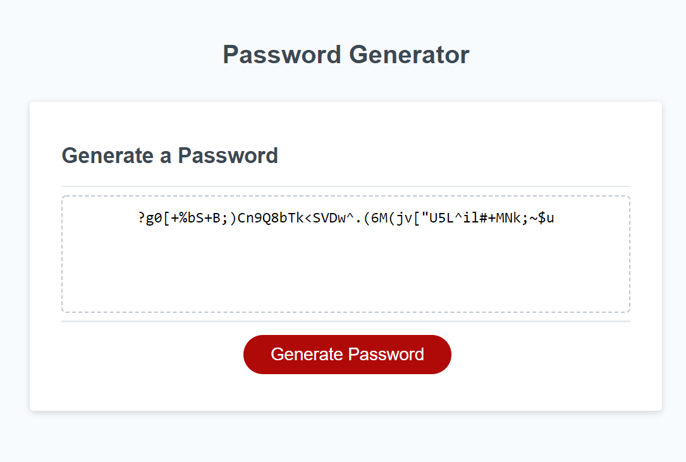

# JavaScript Password Generator

I was give the task of writing a function that can create a randomly generated password that is customized based on user selected options.

I first prompt the user for their selections and then validate each input before proceeding with the next step. 
Once all the input has been collected I build a character set based on the users selections. 
I then pick from that character set at random to build up the password and return it from the function.

### Deployed Application
[Click here to view Application](https://danielstewart914.github.io/JS-Password-Generator/)

